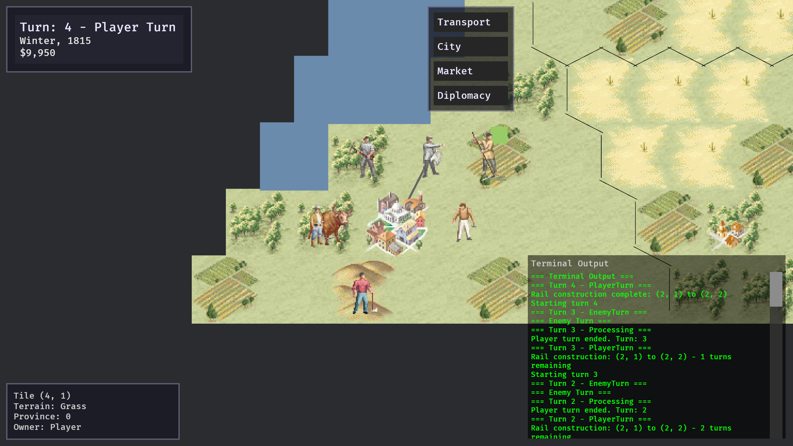

# Rust Imperialism

A modern reimplementation of the classic 1997 strategy game *Imperialism*, built with [Bevy](https://bevy.org/) and Rust.

⚠️ **Work in Progress** - This project is under active development and not yet feature-complete.



## About

This is an economy-first, turn-based strategy game featuring hex-based maps, multi-nation economy and diplomacy. The project aims to recreate the deep economic gameplay of the original while modernizing the technology stack.

## Requirements

**You must own a legitimate copy of Imperialism (1997) to play this game.**

This project requires asset files from the original game. We do not distribute any copyrighted game assets.

### Prerequisites

- Rust toolchain (latest stable)
- A legitimate copy of Imperialism (1997)
- The original game assets extracted and placed in `assets/extracted/bitmaps/`

### Asset Extraction

Before running the game, you need to extract bitmap resources from your copy of Imperialism:

1. Locate your Imperialism installation directory
2. Run the extraction script (requires the game's `.gob` files):
   ```bash
   python ./extract_data.py <path to Imperialism data directory>
   ```
3. This will populate `assets/extracted` with the necessary resources

## Building and Running

```bash
# Build the project
cargo build

# Run the game
cargo run

# Run tests
cargo test
```

## Legal

This is an unofficial fan project. We do not claim any ownership of Imperialism or its assets. 
You must own the original game to use this software.
All original Imperialism assets are copyright SSI/Frog City Software.
